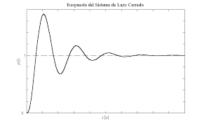

# Métodos Algebraicos en Control Digital

En esta clase se exploran los métodos algebraicos utilizados para modificar la función de transferencia de un sistema en lazo cerrado, con el fin de obtener una respuesta deseada. Estos métodos permiten diseñar controladores que aseguren la estabilidad y el rendimiento del sistema. Se presentan dos enfoques principales: igualación de modelo e igualación de coeficientes.

## Ejemplo de Respuesta en Lazo Cerrado

A continuación se muestra un gráfico que representa la respuesta en lazo cerrado de un sistema diseñado con métodos algebraicos. En este caso, estamos evaluando la estabilidad y el comportamiento subamortiguado:

Este gráfico ilustra cómo se comporta el sistema cuando aplicamos los métodos algebraicos de igualación de modelo para mejorar la estabilidad del sistema.

## 1. Introducción a los Métodos Algebraicos

🔑 *Definición: Los *métodos algebraicos son técnicas que emplean álgebra para diseñar controladores que modifiquen el comportamiento dinámico de un sistema.

## 2. Igualación de Modelo

La igualación de modelo consiste en utilizar una función de transferencia conocida del sistema en lazo cerrado \( G_o(z) \) para calcular la función de transferencia del controlador \( C(z) \), asegurando que el sistema tenga el comportamiento deseado.

### 2.1. Procedimiento

Dado un sistema con función de lazo abierto \( G(z) \), y conociendo la respuesta deseada \( G_o(z) \), la función de transferencia del controlador \( C(z) \) se puede obtener mediante la siguiente fórmula:

$$
C(z) = \frac{G_o(z)}{G(z)(1 - G_o(z))}
$$

💡 *Ejemplo 1*:
Diseñar un controlador que garantice estabilidad, comportamiento subamortiguado y un sobreimpulso menor al 5%, con las siguientes funciones de transferencia:

- \( G_o(z) = \frac{0.009z + 0.008}{z^2 - 1.801z + 0.818} \)
- \( G(z) = \frac{0.004(z + 1)}{z^2 - 1.819z + 0.8187} \)

*Solución*:
Aplicando la fórmula de igualación de modelo:

$$
C(z) = \frac{G_o(z)}{G(z)(1 - G_o(z))} = \frac{(0.009z + 0.008)(z^2 - 1.819z + 0.8187)}{(0.004(z + 1))(z^2 - 1.801z + 0.818 - 0.009z - 0.008)}
$$

Al simplificar:

$$
C(z) = \frac{1.997z^2 + 0.233z - 1.529}{z^2 + 0.125z - 0.757}
$$

## 3. Igualación de Coeficientes

En este método, se conoce la ubicación de los polos deseados en el lazo cerrado. A partir de esto, se calcula el polinomio característico deseado y se determina la función de transferencia del controlador \( C(z) \) que garantizará dicho comportamiento.

### 3.1. Procedimiento

- Conocer la función de transferencia del sistema en lazo abierto \( G(z) \).
- Establecer la ubicación de los polos deseados y formar el polinomio característico.
- Obtener la función de transferencia del controlador \( C(z) \).

💡 *Ejemplo 2*:
Diseñar un controlador proporcional para un sistema con la siguiente función de transferencia:

- \( G(z) = \frac{0.0043}{z^2 - 1.819z + 0.8187} \)

Polos deseados en lazo cerrado:
- \( P_1 = 0.91 + j0.23 \)
- \( P_2 = 0.91 - j0.23 \)

El polinomio característico deseado es:

$$
z^2 - 1.82z + 0.881
$$

Al igualar coeficientes, se obtiene el valor del controlador proporcional \( K = 14.48 \).

## 4. Consideraciones de Implementación

Al implementar controladores utilizando estos métodos, es importante tener en cuenta las siguientes consideraciones:
- Los compensadores deben ser causales.
- El modelo objetivo debe ser estable.
- No deben ocurrir cancelaciones de polos y ceros.
- Los ceros de la planta (fase no mínima) se mantendrán en lazo cerrado.

## 5. Ejercicios

### 📚 *Ejercicio 1*:
Diseñar un controlador que garantice estabilidad y sobreimpulso menor al 5% para la planta:

$$
G(z) = \frac{0.01(z+1)}{z^2-2.01z+1}
$$

*Solución*:
1. Aplicar la fórmula de igualación de modelo.
2. El controlador será:

$$
C(z) = \frac{G_o(z)}{G(z)(1 - G_o(z))}
$$

Donde \( G_o(z) \) es la función deseada de lazo cerrado.

### 📚 *Ejercicio 2*:
Utilizando la igualación de coeficientes, diseñar un controlador proporcional para el sistema:

$$
G(z) = \frac{0.0043}{z^2 - 1.819z + 0.8187}
$$

Polos deseados:
\( P_1 = 0.91 + j0.23 \quad P_2 = 0.91 - j0.23 \)

*Solución*:
El valor de \( K = 14.48 \) al igualar los coeficientes del polinomio característico deseado.

## 6. Conclusiones

En esta clase hemos estudiado los métodos algebraicos para el diseño de controladores en sistemas de control digital. Tanto la igualación de modelo como la igualación de coeficientes son técnicas poderosas que permiten obtener el comportamiento deseado en lazo cerrado.

## 7. Referencias

- Barrero Mendoza, O. Sistemas de control digital. Universidad de Ibagué, 2021.
- Ramos, G. Material curso Control Digital. Universidad Nacional de Colombia, 2015
