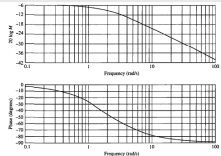

# Análisis en Frecuencia

El análisis en frecuencia permite observar el comportamiento de un sistema a partir de variaciones en la frecuencia de la señal de entrada. Utilizando señales sinusoidales, se observan cambios en la amplitud y la fase de la señal de salida, lo que permite inferir las características del sistema.

## Diagrama de Bode

El diagrama de Bode es una herramienta clave en el análisis en frecuencia. En el gráfico siguiente se muestra cómo varía la ganancia y el desfase de un sistema con respecto a la frecuencia de entrada:

Este diagrama permite ver los márgenes de fase y ganancia, ayudando a verificar la estabilidad del sistema.

## 1. Definición

🔑 *Definición: El *análisis en frecuencia es un método para estudiar el comportamiento dinámico de un sistema mediante señales periódicas, observando cómo varían la magnitud y la fase de la señal de salida con respecto a la frecuencia de la señal de entrada.

## 2. Representación con Fasores

Las señales sinusoidales se pueden representar en forma de fasores, lo que facilita el análisis matemático al reducir la representación de las señales a su magnitud y fase.

### 2.1. Procedimiento

Si una señal de entrada sinusoidal es $ R(t) = A \sin (\omega kT + \theta) $, su representación en fasores es:

$
R = A \angle \theta
$

Donde $ A $ es la amplitud y $ \theta $ es la fase de la señal.

## 3. Diagramas de Bode

El diagrama de Bode muestra cómo varían la magnitud y el desfase de un sistema en función de la frecuencia de la señal de entrada.

### 3.1. Características de los Diagramas de Bode

- *Escala logarítmica*: La magnitud se mide en decibelios (dB) y se calcula como:

$
A_{dB} = 20 \log_{10} (A)
$

- *Fase*: El desfase entre la señal de entrada y la de salida se expresa en grados (°).

💡 *Ejemplo 1*:
Para una función de transferencia discreta $ H(z) $, el diagrama de Bode se calcula usando $ H(e^{j \omega T}) $:

$
H(e^{j \omega T}) = \frac{1}{(e^{j \omega T} - 0.1)(e^{j \omega T} - 5)}
$

## 4. Análisis Frecuencial en Tiempo Discreto

En sistemas discretos, se utiliza la transformación bilineal (Tustin) para aproximar el análisis en tiempo continuo.

### 4.1. Transformación Bilineal

La transformación bilineal se define como:

$
w = \frac{2}{T} \frac{z - 1}{z + 1}
$

Esto permite transformar una función de transferencia del dominio continuo al dominio discreto.

## 5. Consideraciones de Implementación

- *Frecuencia de Nyquist*: Los compensadores deben ser diseñados para operar efectivamente hasta esta frecuencia.
- *Causalidad y estabilidad*: El sistema debe ser causal y estable en el lazo cerrado.

## 6. Ejercicios

### 📚 *Ejercicio 1*:
Encontrar el equivalente de la función de transferencia para un sistema con:

$
G(s) = \frac{8}{s^2 + 6}
$

y un tiempo de muestreo $ T = 0.9 \, \text{s} $.

*Solución*:

1. Aplicamos la transformación bilineal:

$
s = \frac{2}{T} \frac{z - 1}{z + 1}
$

Donde $ T = 0.9 $. Sustituimos en $ G(s) $:

$
G(s) = \frac{8}{s^2 + 6}
$

Se convierte en:

$
G(z) = \frac{8}{\left( \frac{2}{0.9} \frac{z - 1}{z + 1} \right)^2 + 6}
$

2. Simplificando obtenemos la función de transferencia en $ z $:

$
G(z) = \frac{0.226}{z^2 - 1.367z + 0.3679}
$

## 7. Conclusiones

El análisis en frecuencia permite estudiar la estabilidad y el comportamiento dinámico de los sistemas mediante la observación de cómo varía la ganancia y la fase ante cambios en la frecuencia de la señal de entrada.

## 8. Referencias

- Nise, N. Ingeniería de Sistemas de Control, 6ta edición.
- Material de clase de Control Digital.
