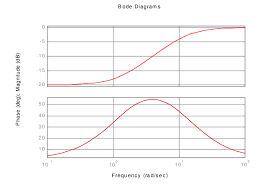

# Diseño de Redes de Atraso por Análisis en Frecuencia

El diseño de compensadores mediante análisis en frecuencia permite ajustar la respuesta de un sistema de control de manera eficiente. Utilizando diagramas de Bode y otras técnicas algebraicas, se pueden garantizar los márgenes de estabilidad y mejorar el rendimiento del sistema.

## 1. Introducción a las Redes de Atraso

🔑 *Definición: Una *red de atraso es un controlador que reduce la ganancia en frecuencias altas para mejorar la estabilidad y reducir el ruido, sin afectar el rendimiento en frecuencias bajas.

## 2. Diseño por Análisis en Frecuencia

El diseño de compensadores por análisis en frecuencia se basa en la observación del diagrama de Bode del sistema, y en la aplicación de la transformación \( w \) para sistemas discretos.

### 2.1. Procedimiento

1. Obtener la función de transferencia del sistema \( G(z) \).
2. Graficar el diagrama de Bode de \( G(w) \).
3. Calcular el controlador \( C(z) \) utilizando el método de redes de atraso.

## 3. Compensadores por Fase

Existen tres tipos de compensadores:

- *Adelanto de fase*: Aumenta la ganancia en frecuencias altas, mejorando la estabilidad.
- *Atraso de fase*: Reduce la ganancia en frecuencias altas, mejorando la estabilidad.
- *Atraso-Adelanto de fase*: Mejora la estabilidad y reduce el error en estado estacionario.

💡 *Ejemplo 1*:
Diseñar un compensador por atraso para un sistema con:

\[
G(z) = \frac{0.0043}{z^2 - 1.819z + 0.8187}
\]

El diseño debe garantizar márgenes de fase y ganancia adecuados.

*Solución*:

1. Graficar el diagrama de Bode del sistema para analizar los márgenes de fase y ganancia.
2. Diseñar el compensador de atraso \( C(z) \) utilizando el siguiente modelo:

\[
C(z) = \frac{1 + T_1 z^{-1}}{1 + T_2 z^{-1}}
\]

Donde \( T_1 \) y \( T_2 \) se ajustan para obtener un margen de fase mayor a 60° y un margen de ganancia mayor a 10 dB.

## 4. Margen de Ganancia y Margen de Fase

- *Margen de ganancia (MG)*: El cambio necesario en la ganancia de lazo abierto para que el sistema se vuelva inestable.
- *Margen de fase (MF)*: El cambio en fase necesario para alcanzar la inestabilidad.

### 4.1. Fórmulas

- Margen de ganancia (MG): Medido en decibelios (dB).
- Margen de fase (MF): Medido en grados (°).

## 5. Ejercicios

### 📚 *Ejercicio 1*:
Diseñar una red de atraso para garantizar un margen de fase mayor a 60° y un margen de ganancia mayor a 10 dB para la planta:

\[
G(z) = \frac{0.0043}{z^2 - 1.819z + 0.8187}
\]

*Solución*:

1. Analizar el diagrama de Bode de la planta \( G(z) \).
2. Diseñar el compensador para ajustar el margen de fase y ganancia.
3. El compensador por atraso se puede calcular como:

\[
C(z) = \frac{1 + T_1 z^{-1}}{1 + T_2 z^{-1}}
\]

Donde \( T_1 \) y \( T_2 \) se ajustan para lograr los márgenes deseados.

## 6. Conclusiones

El diseño de redes de atraso y compensadores por análisis en frecuencia es esencial para garantizar la estabilidad de un sistema de control digital. Es fundamental considerar los márgenes de fase y ganancia al diseñar estos compensadores.

## 7. Referencias

- Chen, C. Analog and Digital Control System Design.
- Nise, N. Ingeniería de Sistemas de Control, 6ta edición.
